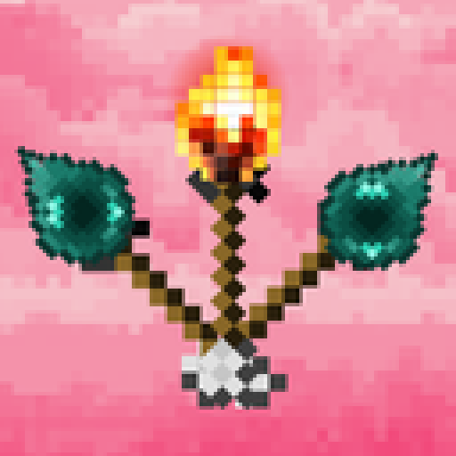
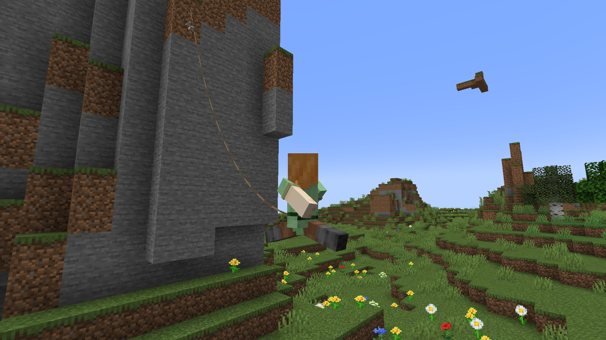
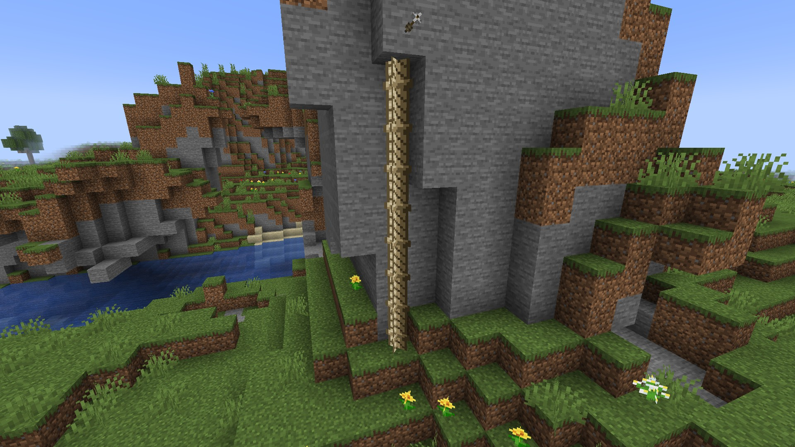
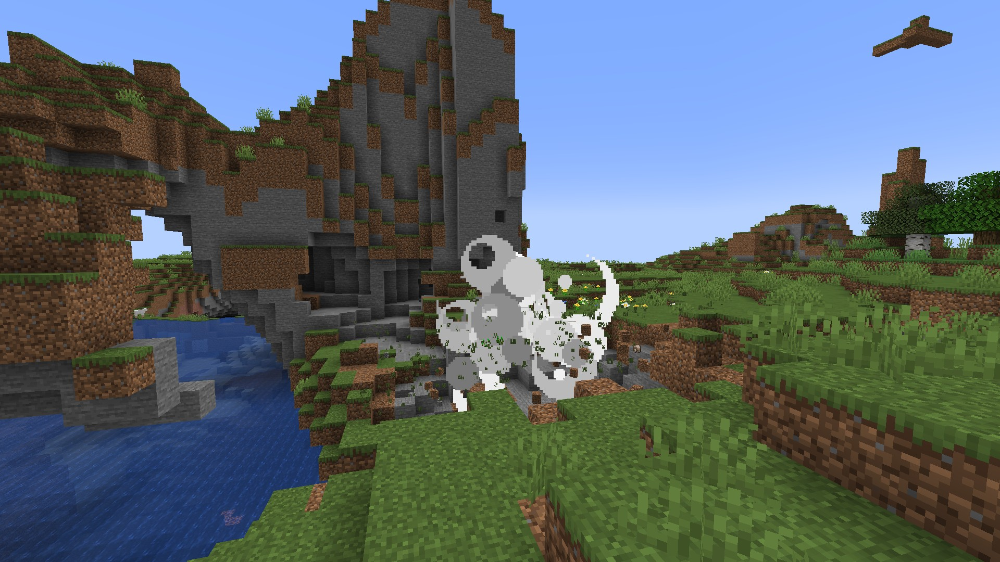
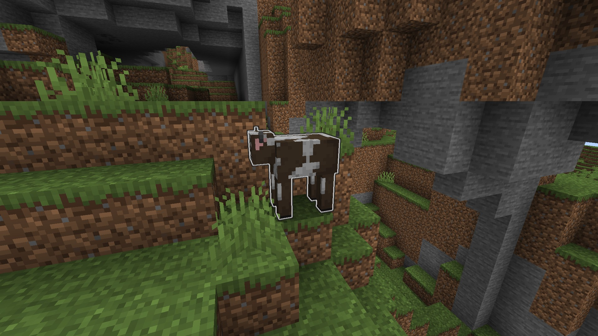
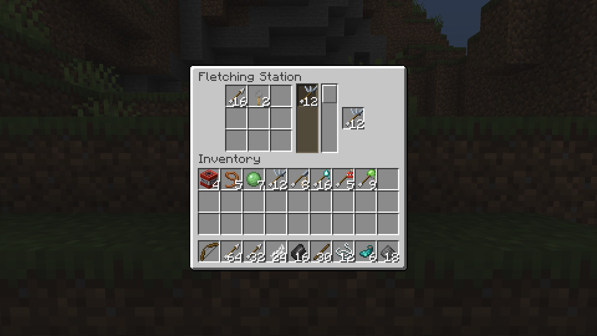

<p align="center"></p>

<h1 align="center">Not Enough Arrows</h1>

<p align="center"><b>Sixty-three new arrows for Minecraft 1.21.1 on Fabric.</b><br>
Grapple up a cliff. Hang a rope into a ravine. Blow a hole in a mountain, then teleport into it.</p>

<p align="center">
<a href="https://modrinth.com/mod/not-enough-arrows"></a>
<a href="https://github.com/grabartley/minecraft-not-enough-arrows/stargazers"></a>
<a href="https://github.com/grabartley/minecraft-not-enough-arrows/blob/main/LICENSE"></a>
<a href="https://ko-fi.com/grahambartley"></a>
</p>

<p align="center">
<a title="Fabric API" href="https://modrinth.com/mod/fabric-api" target="_blank">
	
</a>
</p>

## Your bow deserves better than one arrow

Vanilla gives you an arrow that does one thing: it hurts. Every bow you have ever drawn has been a
slightly slower sword.

**Not Enough Arrows** gives that bow twenty-nine more things to do. The cliff you were going to walk
around becomes a cliff you shoot a hook into and get pulled up. The ravine you were going to bridge
becomes a ravine you drop a rope into. The mountain in your way stops being in your way.

Every one of them is craftable, every one of them is configurable, and every one of them works from
a bow, a crossbow, or a dispenser.

> **Alpha:** Not Enough Arrows is in alpha and feedback is very welcome.
> [Open an issue](https://github.com/grabartley/minecraft-not-enough-arrows/issues/new) and tell me
> what you think.

## Get off the ground

Fire the **grapple arrow** at anything solid and it hooks in and reels you to it. Fall damage is
cancelled when you land, and the arrow comes back to you, so the same one carries you up a mountain
in stages.

<p align="center"></p>

The **rope arrow** is the slower, safer version: it hangs a climbable rope beneath whatever it hits,
up to 128 blocks of it. Shoot the lip of a cliff and the way back up is already built. Shoot into a
ravine and you have a way down that does not involve falling.

<p align="center"></p>

## Cross what you could not walk

Seven more get you somewhere. Fire a **zipline arrow** into one block and another into a second, and
a chain cable strings itself between them; grab it and ride to the far end. The **tow arrow** drags
whatever it hits across the ground to you, over the ravine in between if that is where the ground
goes. The **updraft arrow** opens a column of rising wind that lifts everyone standing in it, and
lets them go at the top. The **vine arrow** grows a climbable vine up a wall, the **trampoline
arrow** puts down a pad that throws you back into the air and takes the sting out of the landing,
the **scaffold arrow** raises a column of scaffolding to climb, and the **bridge arrow** lays a plank
walkway from where it lands back to your feet. Everything but the vines clears away after a while.

## See what is out there

Six more tell you what you are walking into. The **torch arrow** lights the far wall before you get
there, the **beacon arrow** raises a glowing beam anyone can see from a distance, and the **tracer
arrow** draws the line it flew so everyone can see where the shot went. The **prospector arrow**
outlines the ore in the rock around where it lands, the **sonar arrow** makes everything alive
around it glow through the walls, and the **tripwire arrow** leaves an invisible wire that tells
you, and only you, when something walks through it and roughly where.

## Blow something up, eventually

Explosive arrows do not go off on impact. They stick, they beep, the beeping speeds up, and a ring
in the world counts down the time you have left. Plenty of time to admire the angle you fired at,
and just enough to regret it.

<p align="center"></p>

There are three tiers and each is built from the one below it, so the blast you get is the blast you
worked up to. The **incendiary arrow** is the odd one out: it never explodes, it just sets
everything nearby alight.

## Move the world instead

The **gravity arrow** cuts the ground out from under whatever you hit. A sphere of blocks stops
being attached to anything and falls, which is a fast way down through a ceiling and a fast way to
ruin someone's floor.

Six more change the block you hit instead of dropping it. The **drill arrow** mines it and hands you
whatever an iron pickaxe would have got. The **pillar arrow** pushes a column of dirt up out of it
for a while, the **drain arrow** soaks up a pond, the **freeze arrow** turns water to ice and lava to
obsidian, and the **web arrow** hangs cobweb wherever it lands. The **paint arrow** comes in all
sixteen dye colours and recolours wool, carpet, glass, terracotta, candles, and sheep. None of them
touches anything you could not have changed standing there with the item it was crafted from.

The **glow ink arrow** outlines what you hit through walls, for everyone on the server, so the
creeper behind the ridge is now a problem everybody can see.

<p align="center"></p>

## Tend the farm from where you stand

Six arrows do the farm round for you. The **blossom arrow** bone meals everything around where it
lands, the **harvest arrow** reaps every ripe crop nearby, replants it, and puts the harvest in your
inventory, and the **till arrow** hoes a circle of ground into wet farmland. The **sapling arrow**
comes in one kind per sapling and plants it where it lands. The **shear arrow** shears a sheep, a
mooshroom, a snow golem, a bogged, a pumpkin, or a full beehive without hurting anything, and the **bee arrow**
lets loose a few bees that go for whatever you hit and never for you. They leave after a while.

## Win the fight differently

Nine arrows change a fight without making your bow hit harder. The **shock arrow** calls lightning
down on what it hits and jumps once to whatever is standing closest, lighting no fires on the way.
The **lifesteal arrow** gives you back a share of the damage it dealt. The **homing arrow** curves
toward hostile mobs, and never toward a player, which is not a setting you can change.

The **volley arrow** splits in the air into a handful of ordinary arrows, and the **railgun arrow**
goes very fast and drops very little. The rest are status in arrow form: rust, milk, haste and
guard, fired at whatever needs them.

## Take something out of the fight without killing it

Seven arrows change what a creature is doing rather than how much health it has. The **taunt arrow**
pulls every mob already fighting something over to where it landed, and the **repel arrow** sends
them the other way.

The **allegiance arrow** turns the mob it hits into your bodyguard: it stops fighting you and goes
after whoever is attacking you instead, until it wears off and remembers whose side it was on.

The **smoke arrow** opens a cloud that blinds anything standing in it and blocks nothing at all, so
your own arrows still go through. The **disarm arrow** knocks the sword out of a hand and throws it
across the ground, which is a problem for whoever has to go and fetch it.

Vanilla already brews a tipped arrow for nearly every debuff, so none of these repeats one.

## Do something for the sake of it

Six arrows exist because they are funny. The **party arrow** bursts into fireworks and plays the
music disc it was made from, once, for everyone nearby. The **chicken arrow** delivers a live
chicken. The **puffer arrow** blows whatever it hits up to twice its size, so it takes twice the
knockback and no longer fits through a one-block gap, without ever hurting it.

The **stink arrow** leaves a cloud that makes players queasy and that mobs refuse to walk into. The
**boomerang arrow** hits, then curves back through the air into your inventory. The **polymorph
arrow** turns a hostile mob into a farm animal for a while; it wanders about, cannot hurt anyone,
and changes back exactly as it was. It never touches players, villagers, pets or bosses.

## Do something for someone else

The **courier arrow** carries one stack to whoever you hit. Craft an empty courier arrow with a
stack to load it, craft it on its own to take the stack back out, and the tooltip says what it is
carrying. A player it hits gets the stack, a full inventory finds it at their feet, and anywhere
else it lands where the arrow does. It never hurts anyone, and it reaches a friend even with PvP off.

The **snow golem arrow** builds a snow golem where it lands, without its pumpkin, which melts
away after a while. The **magnet arrow** pulls the loose items and experience orbs around where it lands back
toward you, where you pick them up the ordinary way.

## The full set

| | Arrow | What it does | Craft it from |
|---|---|---|---|
| 🪝 | **Grapple** | Hooks the block it hits and reels you to it | Tripwire hook |
| 🪢 | **Rope** | Hangs a climbable rope beneath the block it hits | Lead |
| ✨ | **Glow ink** | Outlines what you hit through walls, for everyone | Glow ink sac |
| 🔴 | **Redstone** | Powers the block it hits, then stops | Redstone dust |
| 💨 | **Wind** | Shoves everything around the impact. Not you | Wind charge |
| 💥 | **Gunpowder** | A blast on a fuse. The first explosive tier | Gunpowder |
| 🧨 | **TNT** | A bigger blast. Built from gunpowder arrows | TNT |
| 🔥 | **Fire charge** | The biggest blast, and it leaves fire. Built from TNT arrows | Fire charge |
| 🕯️ | **Incendiary** | Sets everything nearby alight. Never explodes | Fire charge |
| 🪨 | **Gravity** | Drops the block you hit, like sand | Slime ball |
| ⚙️ | **Ricochet** | Bounces off blocks instead of sticking | Iron nugget |
| 🟣 | **Ender pearl** | Teleports you to wherever it lands | Ender pearl |
| 🌀 | **Recall** | Brings whatever you hit back to you. Built from ender pearl arrows | Fermented spider eye |
| ⚡ | **Shock** | Lightning on what you hit, jumping once. Starts no fires | Lightning rod |
| 🩸 | **Lifesteal** | Gives you back a share of the damage it dealt | Ghast tear |
| 🟩 | **Rust** | Mining fatigue on what you hit | Oxidised copper block |
| 🥛 | **Milk** | Strips every effect from what you hit, good and bad | Milk bucket |
| ⭐ | **Haste** | Haste on what you hit, friend or enemy | Sugar |
| 🛡️ | **Guard** | Absorption on what you hit, friend or enemy | Shield |
| 🧭 | **Homing** | Curves toward hostile mobs. Never toward a player | Compass |
| 🪶 | **Volley** | Splits in the air into a handful of ordinary arrows | Feather |
| 🗜️ | **Railgun** | Very fast, and it barely drops | Iron ingot |
| 🧊 | **Frost** | Holds what you hit frozen, the way powder snow does | Powder snow bucket |
| 🎈 | **Levitation** | Floats what you hit upward, then lets go | Shulker shell |
| 🔔 | **Taunt** | Turns every mob fighting you onto whatever it lands on | Note block |
| 🏃 | **Repel** | Sends every nearby mob running from where it lands | Soul sand |
| 🤝 | **Allegiance** | The mob you hit fights for you for a while | Golden apple |
| 🌫️ | **Smoke** | A cloud that blinds. It blocks nothing | Campfire |
| 🪃 | **Disarm** | Throws the held item across the ground | Fishing rod |
| ⛏️ | **Drill** | Mines the one block you hit and hands you its drop | Iron pickaxe |
| 🟫 | **Pillar** | Raises a column of dirt on the block you hit, for a while | Dirt |
| 🧽 | **Drain** | Soaks up the water where it lands | Sponge |
| ❄️ | **Freeze** | Water to ice, lava to obsidian, fire out. Hurts nothing | Blue ice |
| 🕸️ | **Web** | A patch of cobweb where it lands, for a while | Cobweb |
| 🎨 | **Paint** | Recolours wool, carpet, glass, terracotta, candles, and sheep | Any dye, one colour each |
| 🌼 | **Blossom** | Bone meals everything around where it lands | Bone meal |
| 🌾 | **Harvest** | Reaps and replants every ripe crop nearby, into your inventory | Iron hoe |
| 🟤 | **Till** | Turns a circle of grass and dirt into wet farmland | Water bucket |
| 🌱 | **Sapling** | Plants its sapling where it lands | Any sapling, one kind each |
| ✂️ | **Shear** | Shears sheep, mooshrooms, snow golems, bogged, pumpkins, and full hives | Shears |
| 🐝 | **Bee** | A few bees that go for what you hit, never for you | Honeycomb |
| ⛓️ | **Zipline** | Two shots string a cable between two blocks. Ride it | Chain |
| 🪝 | **Tow** | Drags what it hits across the ground to you | Grapple arrows and a fermented spider eye |
| 🌬️ | **Updraft** | A column of wind that lifts everyone in it | Breeze rod |
| 🌿 | **Vine** | Grows a climbable vine up the wall it hits | Vine |
| 🟩 | **Trampoline** | A pad that throws you back up, with no fall damage | Slime block |
| 🪜 | **Scaffold** | A column of scaffolding to climb, for a while | Scaffolding |
| 🌉 | **Bridge** | A plank walkway from where it lands back to you, for a while | Oak planks |
| 🔥 | **Torch** | Places a torch where it lands, wherever you could have by hand | Torch |
| 🗼 | **Beacon** | A glowing beam straight up, seen from afar, for a while | Glowstone |
| 💎 | **Prospector** | Outlines the ore around where it lands, through the rock | Amethyst shard |
| 📡 | **Sonar** | Everything alive around where it lands glows through walls | Echo shard |
| 〰️ | **Tracer** | Draws the path it flew, for everyone to see | Glow ink arrows and gunpowder |
| 🕸️ | **Tripwire** | An invisible wire that tells you when something crosses it | Sculk sensor |
| 🎉 | **Party** | Fireworks and the music disc it carries, once | Any music disc, one kind each |
| 🐔 | **Chicken** | Releases a live chicken where it lands | Egg |
| 🐡 | **Puffer** | Inflates what it hits for a while, harmlessly | Pufferfish |
| 🤢 | **Stink** | A cloud that makes players sick and mobs keep out of | Rotten flesh |
| 🪃 | **Boomerang** | Hits, then flies back to your inventory | Chorus fruit |
| 🐑 | **Polymorph** | Turns a hostile mob into a farm animal for a while | Sculk catalyst |
| 📦 | **Courier** | Carries one stack to the player or place it hits | Ender chest |
| ⛄ | **Snow golem** | Builds a snow golem that melts after a while | Carved pumpkin |
| 🧲 | **Magnet** | Pulls loose items and orbs back to you | Iron block |

Every recipe is the vanilla tipped-arrow shape: **eight arrows around one ingredient, for eight
arrows back.** The tiers stack, so eight gunpowder arrows around TNT gives you TNT arrows, and eight
of those around a fire charge gives you the top tier. Recall is built from ender pearl arrows the
same way, so is tow from grapple arrows, and so is tracer from glow ink arrows.

## Cheaper arrows at the fletching table

Right-click any vanilla fletching table and it opens a crafting station that sells this mod's arrows
at a better rate than a crafting table does. Same ingredients, more arrows out.

<p align="center"></p>

Nothing is gated behind it: every arrow stays craftable at a crafting table forever, the station is
just the reward for finding one. The block is untouched vanilla, so uninstalling the mod leaves your
world exactly as it was, and your fletcher keeps their job.

## Quick start

1. Drop Not Enough Arrows and Fabric API into your `mods` folder
2. Load a world, craft eight arrows around a tripwire hook
3. Find the tallest thing nearby and shoot the top of it

No config to edit, no server setup, no extra steps.

## Settings

Everything is adjustable while the server is running, per world, and it sticks across restarts.
Change it in the Mod Menu screen or from the command tree:

```
/nea status                                 read every setting
/nea config <family> <option> <value>       change one
/nea config reset                           back to defaults
```

`/nea` and `/notenougharrows` are the same command. Reading is open to anyone; changing anything
needs operator level 2, which in a single-player world means cheats are on. Running `/nea` on its
own lists only the commands you can use. The families are `explosive`, `grapple`, `utility`,
`physics`, `ender`, `combat`, `control`, `traversal`, `terrain`, `agriculture`, `discovery`,
`chaos`, `social`, `fletching`, and `sound`.

The defaults ship the fun version of the mod rather than the safe one, so on a shared server these
are the ones to turn **down**:

- **`explosive.damageTerrain` is on.** Explosive arrows break blocks out of the box. Turn it off and
blasts still throw entities around, they just leave the scenery alone.
- **`ender.recallAffectsPlayers` is on.** A recall arrow can drag another player, and their boat,
back to the shooter, and a tow arrow can drag them across the ground. Turn it off and only mobs
move.
- **`physics.gravityImpactRadius` is 3**, so a gravity arrow drops a sphere rather than the single
block it hit. Set it to 0 for one block.
- **`control.disarm.affectsPlayers` is on.** A disarm arrow can knock an item out of another
player's hand. Turn it off and only mobs are disarmed.
- **`discovery.sonar.durationTicks` is 200.** A sonar arrow outlines other players through walls,
for everyone, just as it outlines mobs. Set it to 0 and a sonar arrow reveals nothing.

None of that gets past spawn protection or the world border. A gravity arrow asks the world for
permission block by block, fire patches are time-boxed and server-owned, and a teleport that would
land somewhere unsafe is refused rather than relocated. The defaults decide how loud the mod is, not
what it is allowed to touch.

<details>
<summary><b>Every setting, with its default and range</b></summary>

Values from a hand-edited file are clamped to their range. Values from a command or the settings
screen are rejected outright, with the accepted range in the error.

| Setting | Default | Range |
|---|---|---|
| `explosive.gunpowder.delayTicks` | 80 | 0 to 200 |
| `explosive.gunpowder.power` | 4.0 | 0.0 to 20.0 |
| `explosive.tnt.delayTicks` | 70 | 0 to 200 |
| `explosive.tnt.power` | 6.0 | 0.0 to 20.0 |
| `explosive.fireCharge.delayTicks` | 60 | 0 to 200 |
| `explosive.fireCharge.power` | 8.0 | 0.0 to 20.0 |
| `explosive.damageTerrain` | on | on or off |
| `explosive.damageEntities` | on | on or off |
| `explosive.firePatchRadius` | 2 | 0 to 8 |
| `explosive.firePatchDurationTicks` | 200 | 0 to 6000 |
| `explosive.beepVolume` | 1.0 | 0.0 to 1.0 |
| `explosive.incendiary.burnRadius` | 3 | 0 to 8 |
| `explosive.incendiary.igniteSeconds` | 5 | 0 to 60 |
| `explosive.incendiary.ignitesBlocks` | on | on or off |
| `grapple.maxRangeBlocks` | 128 | 4 to 128 |
| `grapple.pullSpeed` | 1.5 | 0.1 to 4.0 |
| `grapple.pullAcceleration` | 0.15 | 0.01 to 4.0 |
| `grapple.cancelFallDamageOnArrival` | on | on or off |
| `grapple.returnArrowOnArrival` | on | on or off |
| `grapple.ropeLengthBlocks` | 128 | 1 to 128 |
| `grapple.ropesDecay` | off | on or off |
| `utility.glowDurationTicks` | 200 | 0 to 6000 |
| `utility.redstoneSignalDurationTicks` | 40 | 0 to 1200 |
| `utility.redstoneSignalStrength` | 15 | 1 to 15 |
| `utility.windBurstRadius` | 3.0 | 0.5 to 16.0 |
| `utility.windPushStrength` | 1.0 | 0.0 to 8.0 |
| `physics.gravityImpactRadius` | 3 | 0 to 8 |
| `physics.gravityBlockExclusions` | empty | up to 256 block ids |
| `physics.ricochetBounceCount` | 3 | 0 to 16 |
| `physics.ricochetRetainsDamage` | on | on or off |
| `ender.pearlMaxRangeBlocks` | 128 | 4 to 128 |
| `ender.recallMaxRangeBlocks` | 128 | 4 to 128 |
| `ender.recallAffectsPlayers` | on | on or off |
| `combat.shock.arcRadius` | 6.0 | 0.0 to 32.0 |
| `combat.shock.damage` | 5.0 | 0.0 to 20.0 |
| `combat.lifesteal.share` | 0.5 | 0.0 to 1.0 |
| `combat.lifesteal.maxHealPerHit` | 4.0 | 0.0 to 20.0 |
| `combat.status.rustDurationTicks` | 200 | 0 to 12000 |
| `combat.status.hasteDurationTicks` | 600 | 0 to 12000 |
| `combat.status.guardDurationTicks` | 600 | 0 to 12000 |
| `combat.homing.turnRate` | 0.2 | 0.0 to 1.0 |
| `combat.homing.searchRadius` | 16.0 | 0.0 to 64.0 |
| `combat.homing.searchConeDegrees` | 60.0 | 0.0 to 180.0 |
| `combat.volley.fragmentCount` | 5 | 2 to 12 |
| `combat.volley.damageShare` | 0.4 | 0.0 to 1.0 |
| `combat.volley.spreadDegrees` | 10.0 | 0.0 to 45.0 |
| `combat.volley.splitDelayTicks` | 4 | 1 to 40 |
| `combat.railgun.speedMultiplier` | 3.0 | 1.0 to 8.0 |
| `combat.railgun.gravityFactor` | 0.25 | 0.05 to 2.0 |
| `control.frost.durationTicks` | 200 | 0 to 1200 |
| `control.levitation.durationTicks` | 60 | 0 to 1200 |
| `control.targeting.tauntRadius` | 8.0 | 0.0 to 32.0 |
| `control.targeting.tauntDurationTicks` | 100 | 0 to 6000 |
| `control.targeting.repelRadius` | 8.0 | 0.0 to 32.0 |
| `control.targeting.repelDurationTicks` | 200 | 0 to 6000 |
| `control.targeting.repelDistance` | 16.0 | 0.0 to 64.0 |
| `control.allegiance.durationTicks` | 3600 | 0 to 6000 |
| `control.allegiance.defendRadius` | 16.0 | 0.0 to 32.0 |
| `control.smoke.radius` | 3.0 | 0.0 to 16.0 |
| `control.smoke.durationTicks` | 200 | 0 to 6000 |
| `control.disarm.affectsPlayers` | on | on or off |
| `control.disarm.throwDistance` | 5.0 | 0.0 to 16.0 |
| `traversal.zipline.maxSpanBlocks` | 32 | 2 to 128 |
| `traversal.zipline.pendingWindowTicks` | 600 | 20 to 6000 |
| `traversal.zipline.rideSpeed` | 0.6 | 0.1 to 3.0 |
| `traversal.zipline.lifetimeTicks` | 1200 | 0 to 12000 |
| `traversal.tow.rangeBlocks` | 32 | 1 to 128 |
| `traversal.tow.maxTicks` | 100 | 1 to 1200 |
| `traversal.tow.speed` | 0.5 | 0.1 to 1.5 |
| `traversal.updraft.heightBlocks` | 12 | 1 to 64 |
| `traversal.updraft.lifetimeTicks` | 200 | 0 to 1200 |
| `traversal.updraft.strength` | 0.4 | 0.0 to 2.0 |
| `traversal.vine.lengthBlocks` | 12 | 1 to 64 |
| `traversal.trampoline.strength` | 1.2 | 0.0 to 4.0 |
| `traversal.trampoline.lifetimeTicks` | 600 | 0 to 12000 |
| `traversal.scaffold.heightBlocks` | 8 | 1 to 64 |
| `traversal.scaffold.lifetimeTicks` | 600 | 0 to 12000 |
| `traversal.bridge.lengthBlocks` | 16 | 1 to 64 |
| `traversal.bridge.lifetimeTicks` | 600 | 0 to 12000 |
| `terrain.drill.enabled` | on | on or off |
| `terrain.drill.toolTier` | 2 | 0 wood, 1 stone, 2 iron |
| `terrain.pillar.enabled` | on | on or off |
| `terrain.pillar.heightBlocks` | 4 | 1 to 16 |
| `terrain.pillar.lifetimeTicks` | 600 | 0 to 12000 |
| `terrain.drain.enabled` | on | on or off |
| `terrain.drain.radius` | 3 | 0 to 8 |
| `terrain.drain.maxBlocks` | 65 | 1 to 512 |
| `terrain.freeze.enabled` | on | on or off |
| `terrain.freeze.radius` | 3 | 0 to 8 |
| `terrain.freeze.maxBlocks` | 65 | 1 to 512 |
| `terrain.web.enabled` | on | on or off |
| `terrain.web.patchRadius` | 1 | 0 to 3 |
| `terrain.web.lifetimeTicks` | 400 | 0 to 12000 |
| `terrain.paint.enabled` | on | on or off |
| `agriculture.blossom.radius` | 2 | 0 to 8 |
| `agriculture.till.radius` | 2 | 0 to 8 |
| `agriculture.harvest.radius` | 3 | 0 to 8 |
| `agriculture.bee.count` | 3 | 1 to 8 |
| `agriculture.bee.lifetimeTicks` | 600 | 20 to 6000 |
| `discovery.torch.enabled` | on | on or off |
| `discovery.beacon.lifetimeTicks` | 1200 | 0 to 12000 |
| `discovery.prospector.radius` | 8 | 0 to 16 |
| `discovery.prospector.durationTicks` | 200 | 0 to 1200 |
| `discovery.prospector.blocks` | 19 vanilla ores | up to 32 block ids |
| `discovery.sonar.radius` | 16 | 0 to 32 |
| `discovery.sonar.durationTicks` | 200 | 0 to 1200 |
| `discovery.tripwire.lifetimeTicks` | 6000 | 20 to 24000 |
| `discovery.tripwire.reportIntervalTicks` | 40 | 20 to 1200 |
| `discovery.tracer.pathLifetimeTicks` | 200 | 0 to 1200 |
| `chaos.party.enabled` | on | on or off |
| `chaos.chicken.enabled` | on | on or off |
| `chaos.puffer.enabled` | on | on or off |
| `chaos.puffer.durationTicks` | 200 | 0 to 1200 |
| `chaos.stink.enabled` | on | on or off |
| `chaos.stink.cloudLifetimeTicks` | 200 | 0 to 1200 |
| `chaos.boomerang.enabled` | on | on or off |
| `chaos.polymorph.enabled` | on | on or off |
| `chaos.polymorph.durationTicks` | 400 | 0 to 2400 |
| `social.courier.maxPayload` | 64 | 1 to 64 |
| `social.courier.undeliverable` | empty | up to 32 item ids |
| `social.snowGolem.lifetimeTicks` | 1200 | 20 to 12000 |
| `social.magnet.radius` | 8 | 0 to 16 |
| `fletching.stationEnabled` | on | on or off |
| `sound.volume` | 1.0 | 0.0 to 1.0 |

The three lists, the gravity arrow's exclusions, the prospector arrow's blocks, and the courier
arrow's undeliverable items, are edited rather than replaced:

```
/nea config physics gravityblockexclusions add <id>
/nea config physics gravityblockexclusions remove <id>
/nea config physics gravityblockexclusions clear
/nea config discovery prospector blocks add <id>
/nea config social courier undeliverable add <id>
```

`remove <id>` and `clear` work the same way on every list.

An identifier longer than 64 characters is refused, so a full list always fits in the packet that
syncs settings to players.

These four are yours alone. They live on your machine, they are never sent anywhere, and changing
them changes nothing for anyone else:

| Setting | Default | Range |
|---|---|---|
| `client.showCountdownRing` | on | on or off |
| `client.playCountdownSound` | on | on or off |
| `client.countdownRingScale` | 1.0 | 0.5 to 2.0 |
| `client.modSoundVolume` | 1.0 | 0.0 to 1.0 |

`sound.volume` and `client.modSoundVolume` scale every sound this mod plays and nothing else, so a
server and a player can each turn the mod down without touching the game's own volume sliders. The
two multiply, and zero on either silences the mod's sounds. Turning them down makes the mod
quieter without shortening how far its sounds carry. Nothing in the mod needs to be heard to
be survived: an explosive arrow's countdown ring still shows with every sound off.

</details>

## Compatibility

Minecraft `1.21.1` on Java `21`, singleplayer or dedicated server, fully multiplayer.

| Dependency | Version | Required | Reason |
|---|---|---|---|
| [Fabric Loader](https://fabricmc.net/use/installer/) | `>=0.16.5` | Yes | Mod loader |
| [Fabric API](https://modrinth.com/mod/fabric-api) | `>=0.107.0+1.21.1` | Yes | Fabric hooks and APIs |
| Mod Menu | any | No | Settings screen in the mods list |
| JEI | any | No | Recipe and info pages |
| EMI | any | No | Recipe and info pages |

**[Mod Menu](https://modrinth.com/mod/modmenu)** puts the settings screen in your mods list.
**[EMI](https://modrinth.com/mod/emi)** and **[JEI](https://modrinth.com/mod/jei)** put every arrow
and every fletching station rate in your recipe lookup. None of these are bundled or required, and
the mod runs identically without them.

## Building it yourself

```bash
./gradlew check        # formatting, unit tests, side-safety, jar checks
./gradlew runClient    # dev client
./gradlew runGametest  # the in-game test suite
```

Add `-Precipe_viewers=true` to `runClient` to launch with JEI and EMI loaded. They are off by
default so their overlays stay out of screenshots.

## Documentation

- [`docs/mechanics.md`](https://github.com/grabartley/minecraft-not-enough-arrows/blob/main/docs/mechanics.md) is the detailed behaviour of every arrow and every shared system
- [`docs/prd.md`](https://github.com/grabartley/minecraft-not-enough-arrows/blob/main/docs/prd.md) is what the mod is: use cases, numbered requirements, and what it deliberately leaves out
- [`docs/adr/`](https://github.com/grabartley/minecraft-not-enough-arrows/blob/main/docs/adr/) is why it is built the way it is
- [`docs/standards.md`](https://github.com/grabartley/minecraft-not-enough-arrows/blob/main/docs/standards.md) is the engineering standards shared across these mods

## Open source

Not Enough Arrows is MIT licensed. Every asset is original work.

If this mod made a mountain more fun to get up, a star on GitHub or a coffee on Ko-fi means a lot.

<a href="https://ko-fi.com/grahambartley" rel="noopener nofollow ugc" target="_blank">

</a>
